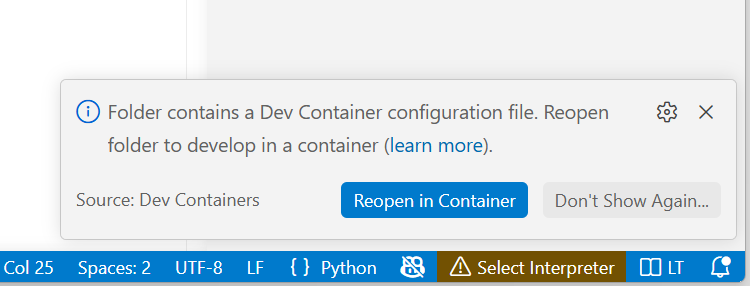
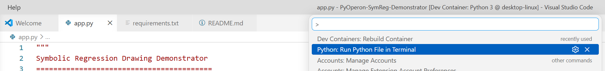
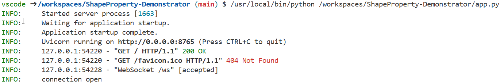
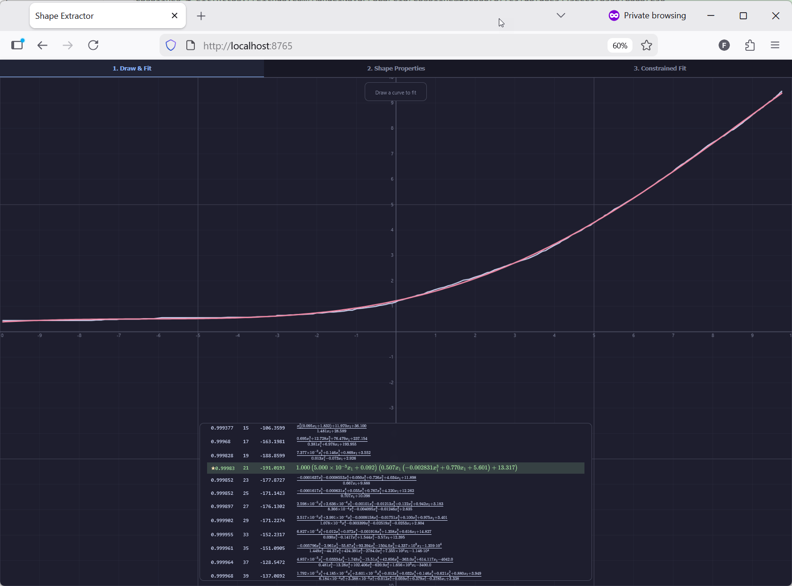
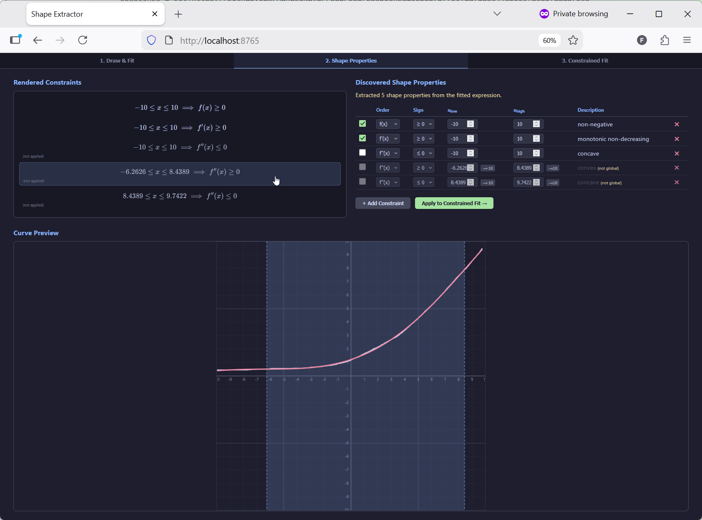
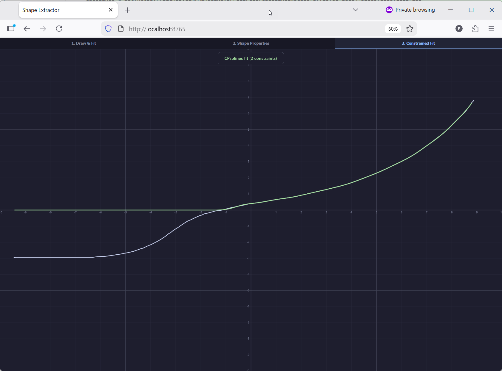

# Shape-Property Demonstrator
Use this app to investigate the shape properties of approximations based on curves you draw yourself. Subsequently, investigate the behavior of shape-constrained regression by enforcing your discovered shape-properties in runs of cpsplines to fit new data.

Draw a curve, discover its shape constraints (monotonicity, convexity, sign) via symbolic regression, then use those constraints to guide a constrained P-spline fit.
The application combines [PyOperon](https://github.com/heal-research/pyoperon) for symbolic regression with [CPsplines](https://github.com/ManuelNavarroGarcia/cpsplines) for shape-constrained non-parametric regression, demonstrating the workflow of automated shape-property inference as described in our publications.

## Demo


## How It Works

The app has three tabs that form a pipeline:

1. **Draw & Fit** — Draw a curve on the canvas. PyOperon runs symbolic regression to find a mathematical expression. Browse the Pareto front of candidate solutions (trading off accuracy vs. complexity).
2. **Shape Properties** — Extract shape constraints from the fitted expression (e.g., non-negative, monotonically increasing, convex) over specific domains. Review, edit, add, or remove constraints. Constraints are rendered as LaTeX formulas.
3. **Constrained Fit** — Draw a (new) curve on the canvas. CPsplines fits a P-spline to the drawn data while enforcing the shape constraints defined in Step 2 as hard constraints.

## Usage

```bash
pip install -r requirements.txt
python app.py
```

Then open `http://localhost:8765` in your browser.

> **Note:** CPsplines requires a [MOSEK](https://www.mosek.com/) license. A free [academic license](https://www.mosek.com/products/academic-licenses/) is available for research and education. Place the license file at `~/mosek/mosek.lic` (Linux/macOS) or `%USERPROFILE%\mosek\mosek.lic` (Windows). For usage with devcontainers, this file is mounted using the docker config. 

## Usage — VS Code

**1. Open in Dev Container**

Reopen the folder in a VS Code Dev Container:



**2. Run the App**

Press `F1` → *Run Python File in Terminal*:



**3. Open in Browser**

Click the link in the terminal to open `http://localhost:8765`:



**4. Draw & Fit (Tab 1)**

Draw any curve on the canvas. PyOperon fits a symbolic expression in the background. Select solutions from the Pareto front panel. Click **Extract Shape Properties** to proceed.



**5. Review Shape Properties (Tab 2)**

Review the automatically extracted shape constraints. Toggle, edit, or add constraints. The LaTeX preview and curve preview update in real time. Click **Apply to Constrained Fit** when ready.



**6. Constrained Fit (Tab 3)**

Draw a curve on the canvas. CPsplines fits a constrained P-spline that respects all enabled shape properties.



## Related Work

**This demonstrator is inspired by and accompanies our following publications:**

Bachinger, F., Haider, C., Zenisek, J., de França, F.O., Affenzeller, M. (2025). Automated Inference of Domain Knowledge in Scientific Machine Learning. In: Quesada-Arencibia, A., Affenzeller, M., Moreno-Díaz, R. (eds) Computer Aided Systems Theory – EUROCAST 2024. Lecture Notes in Computer Science, vol 15172. Springer, Cham. DOI: [10.1007/978-3-031-82949-9_11](https://doi.org/10.1007/978-3-031-82949-9_11)

Bachinger, F., Werth, B., Zenisek, J., Haider, C., de França, F.O.. (2025). SCRBenchmark: A Benchmarking Library for Shape-Constrained Regression. In Proceedings of the Genetic and Evolutionary Computation Conference Companion (GECCO '25 Companion). Association for Computing Machinery, New York, NY, USA, 2505–2513 DOI: [10.1145/3712255.3734280](https://doi.org/10.1145/3712255.3734280)


## Credits

- **Manuel Navarro García** ([@ManuelNavarroGarcia](https://github.com/ManuelNavarroGarcia)) — [CPsplines](https://github.com/ManuelNavarroGarcia/cpsplines) constrained P-splines library
- **Bogdan Burlacu** ([@foolnotion](https://github.com/foolnotion)) — [PyOperon](https://github.com/heal-research/pyoperon) symbolic regression library
- **Lukas Kammerer** ([@LukasCamera](https://github.com/LukasCamera)) for his idea of  [SymReg-Demonstrator](https://github.com/florianBachinger/SymReg-Demonstrator), the predecessor of this demonstrator
- **Claude** — code generation